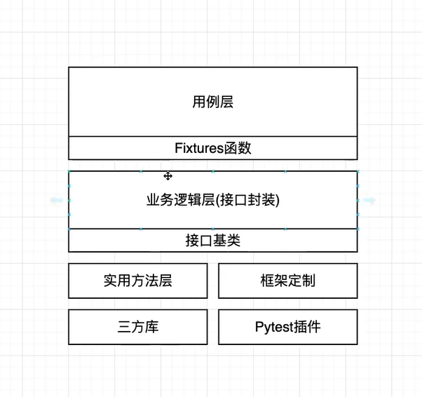

# Api 接口自动化项目
基于pytest+requests库

## 项目结构
### 分层结构


1.用力层：编写用例和Fixture函数

2.业务逻辑层：各个接口的封装

3.实用方法层：数据文件读取/数据库读取/发送邮件等操作

### 项目目录
- apis：业务逻辑层(接口封装)
- data：测试数据/资源目录
- logs：生成的日志目录
- reports：生成报告目录
- testcases：用例层
- utils：实用方法层
- conftest.py：pytest流程定制(钩子函数和全局Fixtures)
- pytest.ini：项目配置
- README.md：项目说明文件
- requirements.txt：项目依赖的三方包

## 使用方式
1.下载项目源码
2.打开命令行cd到该项目的根目录
3.使用命令```pip install -r .\requirements.txt 安装依赖
``
## 多环境配置
在pytest.ini`[pytest]`段配置中使用env=<环境名>来指定当前环境的配置，环境名必须在pytest.ini中存在该段的配置
例如：`env=prod`则pytest.ini中需要有`[prod]`段的配置

另外不同环境，变量约定
- user：后台用户名
- password：用户密码
- base_url：后台服务地址

如何切换环境：
修改pytest.ini中的env配置为制定段环境即可


## 日志配置
pytest.ini中log_file配置项支持动态时间格式，例如：
- logs/run.log：将在项目logs目录下生成固定日志名称run.log
- logs/%Y%m%d.log:将按当前日期生成日志名称，如20230101.log
- logs/%Y%m%d_%H%M%D：将每次运行按开始的时间生成的日志名称，如：20230102_114401.log
> 注：除最后一种情况外，日志中保留最后一次运行的日志


.gitignore 不想上传的目录可以在这里面进行忽略掉